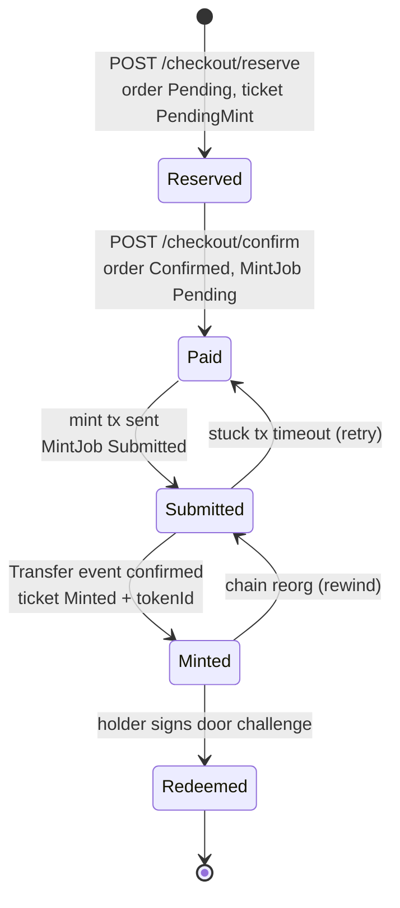
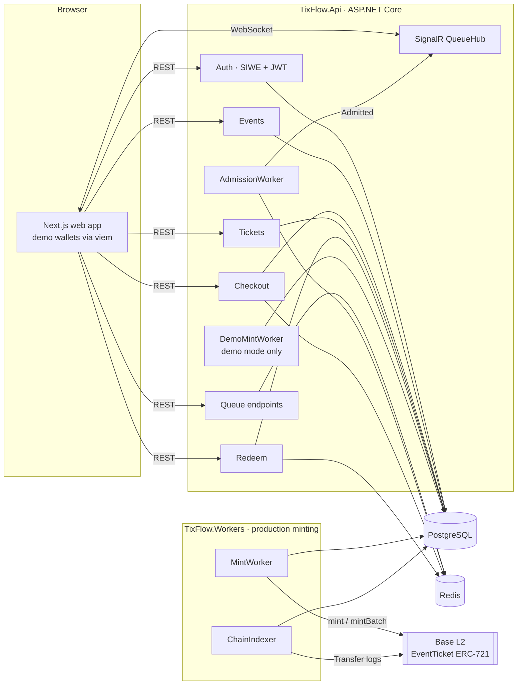
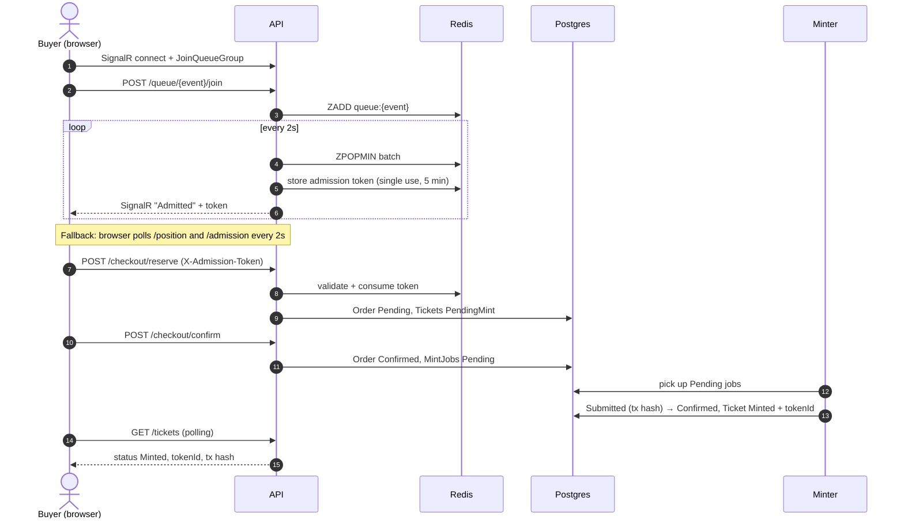

# TixFlow

**Fair-queue event ticketing with NFT tickets on Base L2.**

TixFlow sells tickets the way a sold-out drop should work: buyers wait in a fair first-come queue instead of fighting bots, check out inside a short admission window, and receive an ERC-721 ticket on Base. At the door, the holder proves ownership by signing a one-time challenge, so screenshots and copied QR codes don't get anyone in.

The project runs fully offline in **demo mode**: wallets are generated in the browser (no MetaMask needed), payments are simulated, and NFT minting is simulated by the API so the whole flow completes in seconds without a blockchain connection.

---

## Contents

- [Quick start (Docker)](#quick-start-docker)
- [The user flow](#the-user-flow)
- [Architecture](#architecture)
- [How minting works](#how-minting-works)
- [Tech stack](#tech-stack)
- [Running the project](#running-the-project)
- [Demo events](#demo-events)
- [Working with the database and Redis](#working-with-the-database-and-redis)
- [API reference](#api-reference)
- [Configuration](#configuration)
- [Testing and load testing](#testing-and-load-testing)
- [Project structure](#project-structure)
- [Troubleshooting](#troubleshooting)

---

## Quick start (Docker)

Requires [Docker Desktop](https://www.docker.com/products/docker-desktop/) (or Docker Engine with Compose v2).

```bash
git clone <repo-url> base-ticketing
cd base-ticketing
docker compose up --build
```

Open **http://localhost:3000** and click **Create demo wallet**. Seven demo events are already listed.

| Service    | URL / address                  |
|------------|--------------------------------|
| Web app    | http://localhost:3000          |
| API        | http://localhost:5222          |
| OpenAPI    | http://localhost:5222/openapi/v1.json |
| PostgreSQL | `localhost:5432` (user `tixflow`, password `tixflow_dev`, db `tixflow`) |
| Redis      | `localhost:6379`               |

On first start the API applies database migrations and seeds the demo events automatically. Stop with `Ctrl+C`, or `docker compose down`. To wipe all data and start fresh, run `docker compose down -v`.

---

## The user flow

A complete demo takes about two minutes:

1. **Create a wallet.** Click **Create demo wallet** in the top-right. A private key is generated in the browser and you're signed in with Sign-In with Ethereum (SIWE) automatically. Create a second wallet from the wallet menu to act as an organizer, and switch between them at any time.
2. **Create an event (optional).** As the organizer wallet, open **Organizer → New event**, fill in the name, venue, date and ticket tiers, and click **Publish event**.
3. **Join the queue.** As a buyer wallet, open an event and click **Join the queue**. Your position updates live over SignalR. When your batch is admitted you're taken straight to checkout.
4. **Reserve.** Choose a tier and quantity (up to 4) before the 5-minute admission window closes, then click **Reserve**.
5. **Pay.** Click **Pay … USDC**. Payment is simulated in demo mode.
6. **Watch it mint.** The checkout page shows the mint transaction being sent and confirmed. After a few seconds your NFT ticket appears with a token number and QR code. It also shows up under **My tickets**.
7. **Check in at the door.** Open **Door scanner**, scan the QR code (or pick the ticket from the list if you have no camera), and click **Sign & verify**. A green **Admitted** screen confirms entry. Scan the same ticket again, or sign with a different wallet, to see **Denied**.
8. **Check the dashboard.** Switch back to the organizer wallet. **Organizer** shows tickets sold, check-ins and revenue per tier, refreshing every few seconds.

### Ticket lifecycle



---

## Architecture



| Component | Responsibility |
|-----------|----------------|
| **Web app** (`src/frontend/web`) | Buyer, organizer and door-scanner UI. Holds demo wallets in `localStorage`, signs SIWE logins and door challenges with viem, and listens for queue updates over SignalR. |
| **Auth** | Issues single-use nonces, verifies SIWE signatures (EIP-4361 + EIP-191), finds or creates the user by wallet address, and returns a 24-hour JWT. |
| **Queue + AdmissionWorker** | Each event has a Redis sorted set scored by join time. Every 2 seconds the worker pops the next batch (50 by default), issues each user a signed **admission token** (JWT, 5-minute TTL, single use) and pushes it over SignalR. Joining is rate-limited to 5 requests per 10 seconds per user. |
| **Checkout** | `reserve` sits behind `AdmissionGateFilter`, which validates the admission token, checks that it belongs to the caller, and marks it consumed in Redis. It also checks the tier, the quantity and the remaining supply. `confirm` marks the order paid and creates one `MintJob` per ticket. |
| **Redeem** | Two-step check-in: the API issues a random challenge (stored in Redis for 60 seconds), the holder signs it, and the API recovers the signer and compares it to the ticket owner's wallet. |
| **PostgreSQL** | Source of truth for users, events, tiers, orders, tickets, mint jobs and the indexer checkpoint (EF Core migrations). |
| **Redis** | Queue sorted sets, admission tokens, redemption challenges. |
| **TixFlow.Workers** | Production minting: sends mint transactions and indexes confirmations from Base. Not used in demo mode. |
| **Contracts** (`src/contracts`) | `EventTicket` (ERC-721, owner-only `mint`, `mintBatch`, `redeem`) and `PriceCappedResale` (resale capped at 10% above face value). Built with Foundry. |

### Purchase sequence



---

## How minting works

Minting is asynchronous: confirming an order only writes `MintJob` rows, so checkout stays fast no matter how busy the chain is. Something else turns those jobs into tokens. There are two interchangeable implementations.

### Demo mode: `DemoMintWorker` (default for local and Docker)

Enabled when `Demo:SimulateMint` is `true` (set in `appsettings.Development.json`). It runs inside the API process (`TixFlow.Api/Demo/DemoMintWorker.cs`) and polls the database every second:

| Step | Condition | What it does |
|------|-----------|--------------|
| 1. Submit | `MintJob` is `Pending` and at least 1 second old | Sets the job to `Submitted` and stores a random 32-byte transaction hash (`0x…`) |
| 2. Confirm | `MintJob` has been `Submitted` for at least 3 seconds | Sets the job to `Confirmed`, the ticket to `Minted`, and assigns the next sequential token ID (`max(TokenId) + 1`) |

It writes exactly the same states as the real pipeline, so the frontend, the scanner and the organizer dashboard behave identically. `GET /health/chain` reports `"status": "Simulated"`, and the web app shows a **Demo mode** strip at the top of every page.

> Don't run `TixFlow.Workers` against the same database while `Demo:SimulateMint` is on. Both would pick up the same jobs.

### Production: `TixFlow.Workers`

A separate .NET worker process with two background services:

1. **MintWorker** polls `Pending` jobs every 5 seconds (up to 20 per batch). A single-writer `NonceService` hands out transaction nonces so concurrent mints never collide. It calls `EventTicket.mint(to)` for one ticket or `mintBatch(addresses)` for several via Nethereum. Jobs move to `Submitted` with the transaction hash. Failures are retried up to 3 times, then marked `Failed`.
2. **ChainIndexer** reads `Transfer` events from the zero address (mints) in block ranges, waiting for 2 confirmation blocks. Each event is matched to its job by transaction hash, and the ticket becomes `Minted` with the on-chain token ID. A checkpoint (last block and its hash) is stored in Postgres:
   - **Reorg handling.** If the stored block hash no longer matches the chain, the checkpoint rewinds 15 blocks and recently confirmed jobs revert to `Submitted` until they are re-observed.
   - **Stuck transactions.** Jobs `Submitted` for more than 5 minutes go back to `Pending` and are resubmitted.

To mint for real: deploy `EventTicket` with Foundry (`src/contracts/script/Deploy.s.sol`), set `Mint:RpcUrl`, `Mint:PrivateKey` and `Mint:ContractAddress` in `TixFlow.Workers/appsettings.json` (or environment variables), set `Demo:SimulateMint=false` and `Rpc:BaseUrl` for the API, and run `dotnet run --project src/backend/TixFlow/TixFlow.Workers`.

### Demo wallets

The web app replaces MetaMask with browser-generated wallets (`src/frontend/web/src/lib/auth.tsx`). Keys come from viem's `generatePrivateKey()` and are stored in `localStorage` with a label (Buyer, Organizer, …). Selecting a wallet signs a SIWE message and stores the JWT for that wallet, so switching is instant and reloading keeps you signed in. The keys are real secp256k1 keys, which means the backend verifies signatures exactly as it would for MetaMask. **They are for demos only: never send real funds to them.**

---

## Tech stack

| Layer | Technology |
|-------|------------|
| Frontend | Next.js 16 (App Router, Turbopack), React 19, TypeScript, Tailwind CSS 4 |
| Wallet and crypto (web) | viem (key generation and EIP-191 signing), SIWE message format |
| Realtime | ASP.NET Core SignalR + `@microsoft/signalr` client |
| QR codes | `qrcode.react` (render), `html5-qrcode` (camera scanning) |
| Backend API | ASP.NET Core 10 minimal APIs, JWT bearer auth, built-in rate limiter, OpenAPI |
| Data | PostgreSQL 16 with EF Core 10 (Npgsql), Redis 7 with StackExchange.Redis |
| Ethereum (.NET) | Nethereum (signature recovery, contract calls, log indexing) |
| Smart contracts | Solidity, Foundry, OpenZeppelin ERC-721 |
| Chain | Base L2 (chain ID 8453 / Base Sepolia for testing) |
| Testing | xUnit + `WebApplicationFactory` (36 integration tests), k6 load tests |
| Containers | Docker multi-stage builds, Docker Compose |

---

## Running the project

### Option A: everything in Docker

```bash
docker compose up --build        # foreground, logs in the terminal
docker compose up --build -d     # background
docker compose logs -f api       # follow API logs
docker compose ps                # container status
docker compose down              # stop (data kept)
docker compose down -v           # stop and delete the database volume
```

What Compose starts:

| Container | Image / build | Notes |
|-----------|---------------|-------|
| `postgres` | `postgres:16-alpine` | Data in the `pgdata` volume, with a health check |
| `redis` | `redis:7-alpine` | With a health check |
| `api` | `src/backend/TixFlow/TixFlow.Api/Dockerfile` | Waits for healthy Postgres and Redis, applies migrations (`Database__MigrateOnStartup=true`), seeds demo events, listens on `5222` |
| `web` | `src/frontend/web/Dockerfile` | Next.js standalone server on `3000`, built with `NEXT_PUBLIC_API_URL=http://localhost:5222` |

After changing code, rebuild just what changed, e.g. `docker compose up -d --build api`.

### Option B: databases in Docker, apps on your machine (for development)

Prerequisites: [.NET 10 SDK](https://dotnet.microsoft.com/download), Node.js 20.9+, Docker.

```bash
# 1. Start only Postgres and Redis
docker compose up -d postgres redis

# 2. Apply migrations (once, and after adding new ones)
dotnet tool install --global dotnet-ef   # first time only
dotnet ef database update \
  --project src/backend/TixFlow/TixFlow.Infrastructure \
  --startup-project src/backend/TixFlow/TixFlow.Api

# 3. Run the API on http://localhost:5222 (seeds demo events on start)
dotnet run --project src/backend/TixFlow/TixFlow.Api --launch-profile http

# 4. In another terminal, run the web app on http://localhost:3000
cd src/frontend/web
npm install
npm run dev
```

If the Docker `api` or `web` containers are running, stop them first (`docker compose stop api web`) to free ports 5222 and 3000.

---

## Demo events

The API seeds these events on startup when `Demo:SeedEvents` is `true`. Seeding is idempotent: events have fixed IDs, so restarts never create duplicates. Dates are set relative to the day of first seeding so they're always upcoming. All are owned by a placeholder organizer (`0x…c0ffee`). Events you create yourself appear on your own organizer dashboard.

| Event | Venue | Tiers (USDC) |
|-------|-------|--------------|
| Neon Arches: Synthwave Under the Stars | Arches Amphitheatre, Old Town | General Admission $45 · Pit Standing $85 · VIP Terrace $160 |
| Late Night Laughs: Stand-Up Showcase | The Basement Comedy Club | Standard $18 · Front Tables $30 |
| Base Camp 2026: Onchain Builders Summit | Riverside Convention Hall, Hall B | Student $29 · Builder $149 · Founder $399 |
| Symphony of Distortion: Rock Classics Live with Orchestra | Grand Philharmonic Hall | Balcony $40 · Stalls $75 · Box Seats $220 |
| Velocity Cup 2026: Esports Grand Final | Velocity Arena | Upper Bowl $20 · Lower Bowl $55 · Front Row + Meet & Greet $180 |
| Harvest Table: Wine & Food Festival | Old Vine Estate, Kakheti Valley | Day Pass $35 · Tasting Pass $70 · Winemaker's Dinner $190 |
| Kinetic: Contemporary Dance Premiere | Studio Theatre No. 9 | Standard $28 · Premium $48 |

Each event has a multi-paragraph description. Edit or add events in `src/backend/TixFlow/TixFlow.Api/Demo/DemoEventSeeder.cs`.

You can also create events:

- **In the UI:** Organizer → New event.
- **Through the API:**
  ```bash
  curl -X POST http://localhost:5222/events \
    -H "Authorization: Bearer <jwt>" -H "Content-Type: application/json" \
    -d '{"name":"My Show","description":"…","venueName":"Main Hall","startsAt":"2026-12-01T19:00:00Z",
         "tiers":[{"name":"GA","priceUsdc":25,"totalSupply":200}]}'
  ```
  To get a JWT, open the browser dev tools on the web app and copy a `tixflow.jwt.<address>` value from Local Storage.

---

## Working with the database and Redis

### PostgreSQL

```bash
docker compose exec postgres psql -U tixflow -d tixflow
```

Or connect with any client (DBeaver, pgAdmin, DataGrip, VS Code): host `localhost`, port `5432`, database `tixflow`, user `tixflow`, password `tixflow_dev`.

Table names are PascalCase and must be quoted:

```sql
-- Events with sold / supply per tier
SELECT e."Name", t."Name" AS tier, t."PriceUsdc", t."TotalSupply",
       (SELECT COUNT(*) FROM "Tickets" k WHERE k."TicketTierId" = t."Id") AS sold
FROM "Events" e JOIN "TicketTiers" t ON t."EventId" = e."Id"
ORDER BY e."StartsAt", t."PriceUsdc";

-- Ticket status breakdown (0 = PendingMint, 1 = Minted, 2 = Redeemed)
SELECT "Status", COUNT(*) FROM "Tickets" GROUP BY "Status";

-- Latest orders (0 = Pending, 1 = Confirmed)
SELECT "Id", "Status", "Quantity", "CreatedAt" FROM "Orders" ORDER BY "CreatedAt" DESC LIMIT 10;

-- Mint pipeline (0 = Pending, 1 = Submitted, 2 = Confirmed, 3 = Failed)
SELECT "Status", COUNT(*) FROM "MintJobs" GROUP BY "Status";

-- Users (one per wallet)
SELECT "Id", "WalletAddress", "CreatedAt" FROM "Users" ORDER BY "CreatedAt" DESC;
```

### Redis

```bash
docker compose exec redis redis-cli
```

```text
KEYS queue:*                          # active queues (sorted sets per event)
ZRANGE queue:<eventId> 0 -1 WITHSCORES   # who is waiting, scored by join time
KEYS admission:*                      # issued admission tokens (hash: userId, eventId, consumed)
KEYS admitted:*                       # latest admission per user (used by the polling fallback)
KEYS redeem:challenge:*               # pending door challenges (60 s TTL)
```

---

## API reference

| Method | Path | Auth | Description |
|--------|------|------|-------------|
| GET | `/auth/nonce` | — | Single-use SIWE nonce |
| POST | `/auth/verify` | — | `{ message, signature }` → `{ token }` |
| GET | `/auth/me` | JWT | Current user ID and wallet |
| GET | `/events` | — | All events with tiers and sold counts |
| GET | `/events/{id}` | — | One event with per-tier sold and redeemed counts |
| POST | `/events` | JWT | Create an event with tiers (caller becomes organizer) |
| POST | `/queue/{eventId}/join` | JWT | Join the queue (rate-limited) → position and estimated wait |
| POST | `/queue/{eventId}/leave` | JWT | Leave the queue |
| GET | `/queue/{eventId}/position` | JWT | Current position (404 once admitted) |
| GET | `/queue/{eventId}/admission` | JWT | Unused admission token, if admitted |
| POST | `/checkout/reserve` | JWT + `X-Admission-Token` | `{ eventId, tierId, quantity }` → `orderId` |
| POST | `/checkout/confirm` | JWT | `{ orderId, txHash }` → queues mint jobs |
| GET | `/tickets` | JWT | Caller's tickets with event, tier, token ID and mint tx hash |
| GET | `/tickets/{id}` | JWT | One of the caller's tickets |
| POST | `/redeem/{ticketId}/challenge` | — | One-time challenge (60 s) |
| POST | `/redeem/{ticketId}/confirm` | — | `{ challenge, signature }` → admitted, or 403/409 with a reason |
| GET | `/health/chain` | — | `Healthy`, `Simulated` or `Degraded` |
| WS | `/hubs/queue` | JWT (`access_token`) | SignalR: `JoinQueueGroup(eventId)`; server sends `Admitted` and `QueueUpdate` |

`src/backend/TixFlow/TixFlow.Api/TixFlow.http` has ready-made requests for the VS Code REST Client or Rider.

---

## Configuration

API settings (`appsettings*.json`, or environment variables using `__` as the separator, e.g. `Queue__DefaultBatchSize=100`):

| Key | Default (Development) | Purpose |
|-----|-----------------------|---------|
| `ConnectionStrings:DefaultConnection` | local Postgres | EF Core connection |
| `ConnectionStrings:Redis` | `localhost:6379` | Redis connection |
| `Jwt:Key` / `Issuer` / `Audience` / `ExpiryHours` | dev key, `TixFlow`, 24 | JWT signing. **Replace the key outside development.** |
| `Queue:DefaultBatchSize` | 50 | Users admitted per tick |
| `Queue:DefaultIntervalSeconds` | 2 | Seconds between admission ticks |
| `Queue:AdmissionTokenTtlMinutes` | 5 | Checkout window after admission |
| `Demo:SimulateMint` | `true` | Run `DemoMintWorker` inside the API |
| `Demo:SeedEvents` | `true` | Seed the demo events on startup |
| `Database:MigrateOnStartup` | `false` (`true` in Docker) | Apply EF migrations on startup |
| `Rpc:BaseUrl` | — | When set, `/health/chain` reports `Healthy` |

Web app: `NEXT_PUBLIC_API_URL` (default `http://localhost:5222`) is inlined at build time and must be reachable from the user's browser. The API allows CORS from `http://localhost:3000`; change the policy in `Program.cs` if you serve the web app elsewhere.

Workers (`TixFlow.Workers/appsettings.json`): `Mint:RpcUrl`, `Mint:PrivateKey`, `Mint:ContractAddress`, `Mint:PollIntervalSeconds`, `Mint:MaxBatchSize`, `Mint:MaxAttempts`, `Indexer:ConfirmationBlocks`, `Indexer:ReorgRewindBlocks`, `Indexer:ContractDeployBlock`, `Indexer:StuckTxTimeoutMinutes`.

---

## Testing and load testing

### Integration tests

```bash
dotnet test src/backend/TixFlow/TixFlow.Tests
```

These 36 tests cover SIWE auth, the queue and admission gate, checkout, minting, the indexer (including reorgs and stuck transactions) and redemption. They use an in-memory database and an in-memory queue store, so no Docker is needed.

### Load test (k6)

Simulates a burst of 1,000 virtual users hitting reserve and confirm at once, then verifies that nothing was double-booked.

```bash
docker compose up -d postgres redis        # plus the API running in Development
cd loadtest && npm install
node seed.mjs                              # USERS=2000 SUPPLY=10000 by default
k6 run checkout.k6.js                      # BASE_URL defaults to http://localhost:5222
node verify.mjs                            # fails if any duplicate reservations exist
```

Latest results ([`loadtest/results.md`](loadtest/results.md)): 1,000 of 1,000 reservations and confirmations succeeded, **0 server errors**, reserve p95 ≈ 71 ms, confirm p95 ≈ 183 ms. Every other request was correctly rejected with 403, 409 or 429.

### Contracts

```bash
cd src/contracts
forge test
```

---

## Project structure

```
base-ticketing/
├── docker-compose.yml              Postgres, Redis, API and web
├── TixFlow.sln
├── loadtest/                       k6 script, seed and verify scripts, results
└── src/
    ├── contracts/                  Foundry: EventTicket.sol, PriceCappedResale.sol, deploy script, tests
    ├── backend/TixFlow/
    │   ├── TixFlow.Api/            Minimal API: Auth, Events, Queue, Checkout, Tickets, Redeem, Health, Demo
    │   │   ├── Demo/               DemoMintWorker, DemoEventSeeder, DatabaseStartup
    │   │   └── Dockerfile
    │   ├── TixFlow.Domain/         Entities and enums
    │   ├── TixFlow.Infrastructure/ DbContext, EF configurations, migrations
    │   ├── TixFlow.Workers/        MintWorker, NonceService, ChainIndexer (production minting)
    │   └── TixFlow.Tests/          xUnit integration tests
    └── frontend/web/               Next.js app
        ├── src/app/                Pages: events, event, checkout, tickets, scanner, organizer
        ├── src/components/         Header, WalletMenu, TicketPass, CameraScanner, UI kit, toasts
        ├── src/lib/                API client, demo wallet and auth provider, formatting
        └── Dockerfile
```

---

## Troubleshooting

| Symptom | Fix |
|---------|-----|
| Red strip: "Can't reach the TixFlow API" | The API isn't running on port 5222. Check `docker compose ps` / `docker compose logs api`, or start it with `dotnet run`. |
| `port is already allocated` when starting Compose | Something else uses 3000, 5222, 5432 or 6379. Stop local `dotnet run` / `npm run dev`, or change the host port in `docker-compose.yml`. |
| Postgres logs `invalid length of startup packet` | Harmless. Something probed the port without speaking the Postgres protocol (often a health check). |
| Scanner shows "Camera unavailable" | Allow camera access in the browser, or use the ticket list or paste the ticket code. Camera access needs `localhost` or HTTPS. |
| "Your checkout window has closed" | Admission tokens last 5 minutes and are single use. Rejoin the queue. |
| Errors after a database reset (`docker compose down -v`) | Saved logins point to users that no longer exist. The API rejects them with 401 and the app signs in again automatically. If something still looks stuck, reload the page or clear the site data. |
| Tickets stuck on "Minting" | Demo mode is off (`/health/chain` isn't `Simulated`) and `TixFlow.Workers` isn't running. Enable `Demo:SimulateMint` or start the workers. |
| Web app calls the wrong API URL in Docker | `NEXT_PUBLIC_API_URL` is baked in at build time. Change the build arg in `docker-compose.yml` and run `docker compose build web`. |

---

## License

See [LICENSE](LICENSE).
